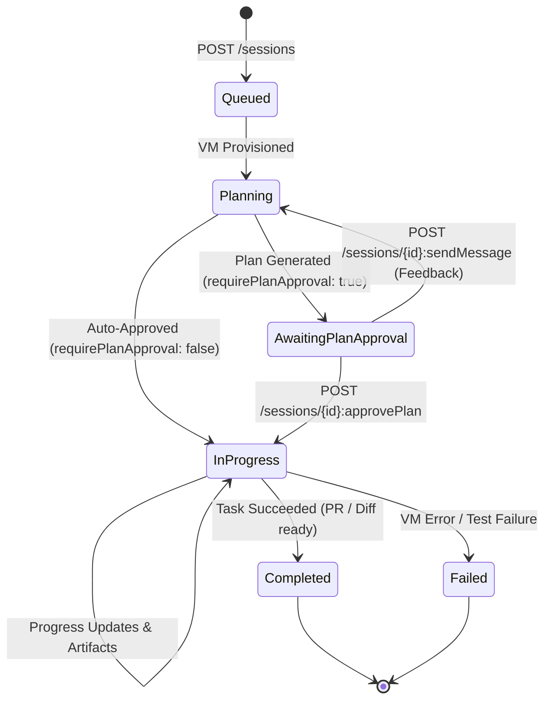

# Cloud Agent Integrations & Google Jules in mjolnr

This document provides the complete architectural, technical, and interface specification for integrating **Cloud Agents** (starting with **Google Jules**) into **mjolnr**.

---

## 1. Overview & Motivation

mjolnr is a local-first AI coding harness with a deterministic Rust governance core, a Tauri desktop client, and a Ratatui TUI. While mjolnr excels at fast, governed local agent loops on the developer's machine, developers often have tasks that benefit from running **asynchronously in isolated cloud environments**:

* Long-running test suite migrations or large refactors across hundreds of files.
* Scheduled continuous maintenance (daily security scans, performance benchmarks, dependency updates).
* Background tasks that should proceed without keeping a local terminal or laptop awake.

**Google Jules** (powered by Gemini 3.6 Flash and Gemini 3 Pro) is Google's cloud coding agent that executes tasks in ephemeral, pre-configured VMs connected to GitHub repositories.

By integrating Google Jules as a **Cloud Agent Integration**, mjolnr bridges the local developer harness with asynchronous cloud execution—without compromising mjolnr's prime directive: **the model proposes, mjolnr's deterministic code disposes**.

---

## 2. Architecture & Ecosystem Taxonomy

mjolnr organizes external capabilities and extensibility into four distinct, well-governed layers:

```
┌─────────────────────────────────────────────────────────────────────────────────┐
│                                   MJOLNR                                        │
├────────────────────────┬───────────────────────────────┬────────────────────────┤
│  1. Core Modules       │  2. Community Plugins         │  3. Governed MCP       │
│  (First-Party Rust)    │  (Installable Extensions)     │  (Standard Tooling)    │
├────────────────────────┼───────────────────────────────┼────────────────────────┤
│ • Policy & Safety Gate │ • Installable via Marketplace │ • Industry-standard    │
│ • Local Git & Memory   │ • JSON-RPC stdio protocol     │   tool connectors      │
│ • Fleet Coordinator    │ • Lifecycle Hooks (observers) │ • Neon, Tinybird, v0,  │
│ • Desktop & TUI shell  │ • Data-only UI Views & Cards  │   Context7, Postgres   │
│ • Core Task Sources    │ • Pinned provenance & auth    │ • Zero-maintenance     │
│   (GitHub, Linear)     │ • Can wrap MCP tools          │   tool expansion       │
├────────────────────────┴───────────────────────────────┴────────────────────────┤
│  4. Cloud Agent Integrations (Async Remote Fleet)                               │
├─────────────────────────────────────────────────────────────────────────────────┤
│ • Ephemeral cloud VMs (Google Jules, and future remote runners)                 │
│ • Asynchronous execution, multi-step plan review, diffs & UI screenshots       │
│ • External provenance: TrustClass::ExternalUnverified + Local Verification Gate│
└─────────────────────────────────────────────────────────────────────────────────┘
```

### Taxonomy Definitions

1. **Capability Modules (First-Party Rust)**: Compiled into the core binary (`src/integrations/`, `src/memory/`, `src/runtime/`). Authoritative, high-performance, and bound by strict architectural boundaries.
2. **Task Sources (`src/integrations/`)**: Bounded read-only context adapters (GitHub, Linear, Vercel deployments, Supabase projects).
3. **Plugins (`docs/adr/0016-plugin-protocol-and-capability-modules.md`)**: Third-party local subprocesses speaking JSON-RPC 2.0 over stdio with manifest-declared permissions, observer-only hooks, and data-only UI cards.
4. **MCP Servers (`docs/mcp.md`)**: Standard tool servers (Neon, Tinybird, Supabase, v0) run under mjolnr's `ToolTier::Execute` approval gate.
5. **Cloud Agents (`docs/adr/0019-cloud-agent-integrations-and-jules.md`)**: Remote cloud execution runtimes that run asynchronously, stream rich activity events, produce plans/diffs/PRs, and integrate into the Fleet Rail.

---

## 3. Google Jules Technical Reference

Based on research into the official Google Jules SDK and REST API contracts (`https://jules.googleapis.com/v1alpha`):

### 3.1 Authentication
* **Protocol**: HTTPS REST with `X-Goog-Api-Key: <JULES_API_KEY>`.
* **Credential Storage**: Stored in mjolnr's owner-only credential file store (`SecretStore` in `src/store/secrets.rs`), redacted from all logs, transcripts, and telemetry.
* **Onboarding**: Configurable via `/auth jules` CLI command or the Desktop Provider Auth Modal.

### 3.2 Key Resources & REST Endpoints

| Resource / Action | Method & Endpoint | Description |
|---|---|---|
| **List Sources** | `GET /sources` | Lists GitHub repositories connected to the user's Jules account. |
| **Get Source** | `GET /sources/github/{owner}/{repo}` | Fetches repository metadata, default branch, and available branches. |
| **Create Session** | `POST /sessions` | Dispatches a cloud task with prompt, title, source context, approval requirements, and PR mode. |
| **List Sessions** | `GET /sessions` | Lists existing sessions (supports AIP-160 filtering e.g. `archived = false`). |
| **Get Session** | `GET /sessions/{id}` | Retrieves session details, current state, URL, and outcome outputs. |
| **List Activities** | `GET /sessions/{id}/activities` | Lists/streams session events (filtered by `create_time>"..."` for incremental sync). |
| **Send Message** | `POST /sessions/{id}:sendMessage` | Sends user feedback or follow-up prompt to the active session. |
| **Approve Plan** | `POST /sessions/{id}:approvePlan` | Approves a proposed plan when the session is `awaitingPlanApproval`. |
| **Archive / Unarchive** | `POST /sessions/{id}:archive` | Toggles session archive status. |
| **Delete Session** | `DELETE /sessions/{id}` | Permanently deletes session from cloud and local mirror. |

### 3.3 Session Lifecycle State Machine



### 3.4 Activities and Artifacts

Activities streamed from Jules carry typed payloads:
* `planGenerated`: Contains `Plan` with an ordered array of `PlanStep` items (`id`, `title`, `description`, `index`).
* `agentMessaged`: Assistant commentary and status notes.
* `userMessaged`: User feedback sent to the cloud agent.
* `progressUpdated`: Milestone updates with intermediate logs and diff chunks.
* `sessionCompleted`: Successful resolution carrying final outputs (`PullRequest` URL and `ChangeSet` unidiff patch).
* `sessionFailed`: Failure report with error reason.

Artifacts embedded inside activities include:
* **`ChangeSet` / `GitPatch`**: Unified git patch (`unidiffPatch`), base commit SHA, and suggested commit message.
* **`MediaArtifact`**: Base64-encoded screenshots (`image/png`) captured during cloud browser/UI tests.
* **`PullRequest`**: GitHub PR URL, branch name, and title/description.

---

## 4. Workload Modalities & UI Patterns

Google Jules supports four execution paradigms that integrate into mjolnr:

1. **Review Mode (Plan-First)**:
   * Jules analyzes the codebase in the cloud VM, drafts a multi-step plan, and transitions to `awaitingPlanApproval`.
   * mjolnr intercepts this state and renders an interactive **Plan Review Modal** with step checkboxes and 1-click approval.
2. **Interactive Mode**:
   * Conversational turn-taking with Jules (`ask` / `send`) to scope out ambiguous requirements before coding begins.
3. **Autonomous Start**:
   * Direct execution in cloud VM with automatic PR creation (`autoPr: true`).
4. **Scheduled Skill-Based Agents**:
   * Recurring maintenance routines running on cron schedules:
     - **Sentinel (Daily Security Scan)**: Hunts hardcoded secrets, injection flaws, and missing input validation.
     - **Optimizer (Weekly Performance Improver)**: Executes benchmark suites and optimizes slow hotspots.
     - **Janitor (Weekly Codebase Cleanup)**: Removes dead code, modernizes syntax, and updates lint rules.
     - **CI Fixer**: Triggered upon failed CI builds to diagnose error logs and open remediation PRs.

---

## 5. mjolnr Governed Integration Architecture

### 5.1 Rust Wire Client (`src/integrations/jules/`)

mjolnr implements a native, zero-external-SDK Rust client using `reqwest` and `serde_json`:

```rust
pub struct JulesClient {
    base_url: String,
    api_key: Secret,
    client: reqwest::Client,
}

impl JulesClient {
    pub async fn list_sources(&self) -> Result<Vec<JulesSource>, IntegrationError>;
    pub async fn create_session(&self, req: CreateSessionRequest) -> Result<JulesSession, IntegrationError>;
    pub async fn get_session(&self, session_id: &str) -> Result<JulesSession, IntegrationError>;
    pub async fn list_activities(&self, session_id: &str, since: Option<&str>) -> Result<Vec<JulesActivity>, IntegrationError>;
    pub async fn approve_plan(&self, session_id: &str) -> Result<(), IntegrationError>;
    pub async fn send_message(&self, session_id: &str, prompt: &str) -> Result<(), IntegrationError>;
}
```

### 5.2 Governed Import & Verification Gate

To uphold **Prime Directive §1** (*The model proposes; code disposes*) and **Prime Directive §3** (*Never lie about state*):

1. **External Provenance**: Code changes from Jules enter mjolnr with `TrustClass::ExternalUnverified`.
2. **Local Worktree Isolation**: When a user inspects a Jules task output, mjolnr fetches the branch or applies the `GitPatch` unidiff to an isolated worktree (`.mjolnr/worktrees/jules-<id>`).
3. **Deterministic Verification Gate**: Before merging changes to the main working branch, mjolnr runs the project's local test and lint suite (`cargo test`, `npm test`, `pytest`). Only upon passing local tests does the state earn the `--gov-verified` status.

```
┌─────────────────┐       ┌─────────────────┐       ┌─────────────────┐       ┌─────────────────┐
│  Google Jules   │  git  │ Isolated Local  │ local │  Deterministic  │ merge │   Authoritative │
│   Cloud VM      │ patch │ Worktree Branch │ tests │   Verify Gate   │ gate  │   Main Branch   │
│  (Proposes Diff)│ ────► │(ExternalUnverif)│ ────► │  (cargo test)   │ ────► │  (Verified Green)│
└─────────────────┘       └─────────────────┘       └─────────────────┘       └─────────────────┘
```

---

## 6. Client Surfaces (Desktop & TUI)

### 6.1 Fleet Rail / Glassbox Projection
* Active Jules sessions appear on the Fleet Rail alongside local subagents.
* Displays live progress spinner, current active step (e.g. `Step 2/4: Implement caching`), and elapsed wall-clock duration.

### 6.2 Plan Review Surface
* Renders plan steps with accordion descriptions.
* Provides **Approve Plan**, **Ask for Changes**, and **Cancel Task** buttons.

### 6.3 Artifact & Media Inspector
* Unified diff viewer with syntax highlighting and line count stats (`+42 -12`).
* Image viewer for UI test screenshots captured by Jules.
* Direct link to the generated GitHub Pull Request.

### 6.4 Cloud Skills Dispatcher
* A dedicated modal in the Desktop UI allowing users to pick a connected GitHub repo, choose a branch, select from curated prompt templates (Security, Performance, Bug Fixer, CI Fixer), set approval requirements, and dispatch.

---

## 7. Extensibility & Marketplace Blueprint

Looking ahead to open-sourcing mjolnr:

1. **Unified Connections Settings**:
   * A visual settings panel (mirroring Jules' MCP settings) with tabs for **Cloud Agents** (Jules, Copilot Workspace), **Core Integrations** (GitHub, Linear), and **Community Plugins & MCP Servers** (Neon, Supabase, Tinybird, v0).
2. **Safe Community Marketplace**:
   * Community contributors can publish plugins via the ADR-0016 JSON-RPC protocol.
   * Because plugins cannot inject arbitrary JS into the desktop webview and all tools require human approval under `ToolTier::Execute`, the marketplace remains safe by construction.
