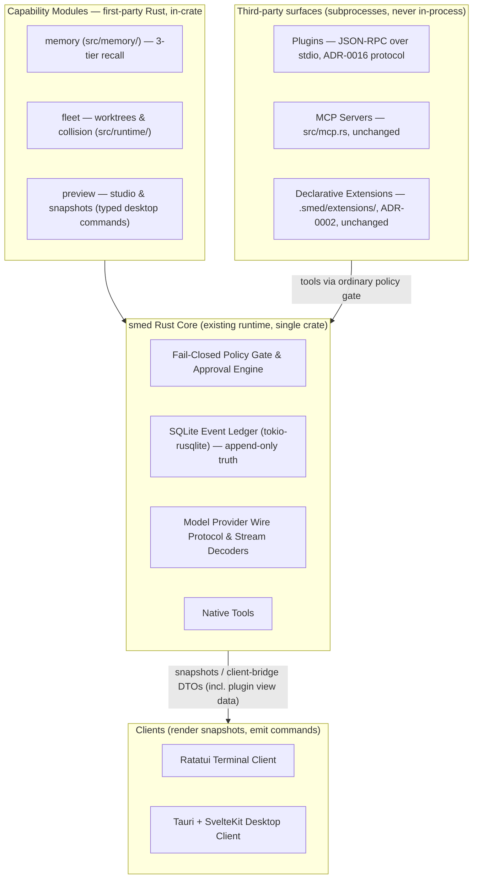
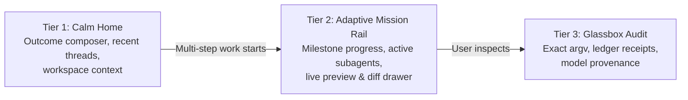
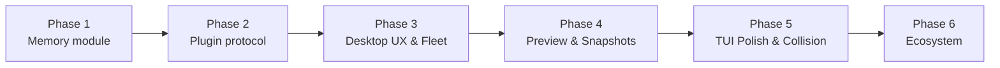

# smed Master Implementation Plan: Governed Agent Workspace — Modules, Memory, and Plugins

**Status:** Proposed Architecture & Execution Plan (revised 2026-08-18 after review against AGENTS.md and ADRs)
**Target:** Shared Rust Core, SvelteKit Tauri Desktop, Ratatui TUI
**Governing decisions:** [`ADR-0016`](./adr/0016-plugin-protocol-and-capability-modules.md) (modules vs plugins), [`ADR-0002`](./adr/0002-scripted-extension-shim.md) (declarative extensions), [`ADR-0003`](./adr/0003-shared-rust-core-tui-tauri-clients.md) (clients), [`ADR-0006`](./adr/0006-bounded-integrated-developer-workspace.md) (trust classes)

---

## 0. Provenance statement (read first)

Research artifacts in `Code/simon-says-research` (Wayland, Orca, jcode, LeanCTX, Ship Studio, and others) **informed requirements and known failure modes only**. Per AGENTS.md §8: no code, tests, comments, naming, structure, or internal protocols are copied, ported, translated, or lightly refactored from any of them. Every feature below is implemented independently from official documentation, published standards, RFCs, and crate documentation. Where a feature resembles a researched product, the resemblance is at the requirements level.

## 1. Architecture: core, capability modules, plugins, MCP

smed keeps the existing single-crate Rust runtime as the core. There is no
microkernel rewrite and no in-process plugin loading. Four kinds of extension
exist, with distinct governance:



**Dependency direction is law** (AGENTS.md §2.1, `tests/architecture.rs`):
clients → runtime → core. Capability modules and plugins never import a
client. Clients render plugin *view data* delivered through the client bridge;
no third-party JavaScript ever loads in the Tauri webview.

| Term | Definition |
|---|---|
| **Capability module** | First-party Rust in the single crate, toggleable via declarable `.smed/` files, subject to the §2.2 extraction test. Never called "plugin" in UI or docs. `@smed/*` naming reserved for these. |
| **Plugin** | Third-party code: local subprocess, versioned JSON-RPC over stdio, fail-closed `smed-plugin.yaml` manifest, owner-granted credentials, observer-only hooks, tools pinned `ToolTier::Execute`, data-only UI views (ADR-0016). |
| **MCP server** | External tool server via `src/mcp.rs`. Tool-only: no lifecycle, no session context, no UI. A plugin may wrap an MCP server. |
| **Declarative extension** | Exact-argv YAML orchestration, `Execute`-gated (ADR-0002). The lightweight entry surface; unchanged. |

---

## 2. Pillar 1: Memory capability module (`src/memory/`)

Transparent, user-editable, temporally accurate memory — as a first-party
module, not a plugin.

```
.smed/
├── rules/                       # Tier 1: Explicit Workspace Rules (diffable Markdown)
│   ├── coding-standards.md
│   └── conventions.md
├── USER.md                      # Tier 1: User Profile (Preferences, Style, Constraints)
└── data/
    └── memory.db                # Tiers 2 & 3: SQLite (Triples, FTS5, [embeddings])
```

**The governing law (Standing Law #2, restated as a design constraint):**
`.smed/data/memory.db` — triples, FTS index, embeddings — is a **disposable,
regenerable projection**. The append-only event ledger and the working tree
are truth. Memory may improve context selection only. It may never widen
policy, approve an action, rewrite the record, or become durable truth.
Consolidation derives from the transcript and never rewrites it. Index loss is
an inconvenience, never data loss.

1. **Tier 1: Explicit Workspace Rules & User Profile**
   - Plain Markdown under `.smed/rules/*.md` and `.smed/USER.md`, injected as
     **frozen snapshots at session start** (zero prompt cache churn).
   - Strict character limits force consolidation.
   - `write_approval` staging gate: rule changes land via the existing
     staged-config pattern (preview-then-write, as in `/config`
     `ConfigStaged` and desktop editor-preferences), then take effect next
     session start. Approvable via `/rules pending` or the desktop UI badge.
2. **Tier 2: Temporal Knowledge Triples & Episodic Memory**
   - In-process SQLite via `tokio-rusqlite` (already a dependency).
   - Subject–predicate–object triples with `valid_from` / `valid_until`;
     updating a fact auto-sets `valid_until` on the superseded triple.
   - Background consolidation compresses working turns into episodic
     summaries — reading the ledger, never writing to it; cancellation via
     `CancellationToken`; bounded work per cycle.
3. **Tier 3: 3-Layer Progressive Recall**
   - `memory_search(query)` → top-K one-line index summaries with IDs.
   - `memory_timeline(id)` → chronological context around an event.
   - `memory_expand(ids)` → full details only for targeted IDs.
   - Hybrid score, **checkpoint 1: FTS5 + recency** (`0.6 × FTS5 + 0.4 × Recency`).
   - **Checkpoint 2 (same phase, gated on dependency review): local
     embeddings** for a vector term. ONNX runtime (`fastembed` or direct
     `ort`) + a pinned MiniLM-class model: downloaded once by explicit owner
     consent, hash-verified, §8 justification + `THIRD_PARTY.md` entry,
     workspace text never leaves the machine. If the dependency is rejected
     in review, the phase ships without the vector term and the weights
     rebalance — recall still works.
4. **Glassbox Memory Inspector** — UI tab in Desktop and TUI to view, search,
   edit, delete, pin facts, and approve staged rules. Edits to Tier 2 facts
   are ordinary writes through the ordinary `Write` gate — no privileged
   path.

---

## 3. Pillar 2: Plugin protocol (ADR-0016 implementation)

The full decision record is ADR-0016; the implementation obligations are:

- `smed-plugin.yaml` manifest: identity, provenance (source URL, publisher,
  content hash), protocol version, tools (JSON schema, no `$ref`), hook
  subscriptions, view descriptors, named credential grants. Unknown fields
  refuse (fail closed).
- `src/plugins/` subprocess host: versioned JSON-RPC over stdio, spawn with
  scrubbed environment, restart + cancellation, bounded channels, honest
  unavailable states on crash.
- **Credentials: no `pass_env`.** Per-plugin owner-approved grants stored in
  smed's owner-only credential files (one file per plugin), injected as env
  vars at spawn only — never argv, never YAML, never logs, `Debug`-redacted,
  zeroized.
- **Hooks are observers only**: `SessionStart`, `UserPromptSubmit`,
  `PreToolCall`, `PostToolCall`, `PostTurn` return annotations (context
  suggestions, notices). They cannot mutate arguments, widen policy, approve,
  or veto. Tool-argument validation stays in `tool_loop.rs::prepare_tool`,
  after the last transformation — hooks are never a transformation.
- **All plugin tools pinned `ToolTier::Execute`** — every call gated,
  previewed, evidenced. Plugins cannot self-declare a tier.
- **Install is a durable event** (`PluginInstalled` / `PluginUpdated`) persisted
  before any capability activates (authorise-then-enable, as extensions do).
  Updates change the pinned hash and require re-approval.
- **UI is data**: view descriptors + JSON payloads rendered by first-party
  generic components in the desktop, text in the TUI, both fed through the
  client bridge. Trust-class visuals per ADR-0006; the plugin hub states
  plainly that plugins run with the user's OS authority and are not sandboxed.
- `tests/architecture.rs` rule for `src/plugins/` (forbidden: `tui`, `store`,
  `providers`) lands **before** the directory does.

---

## 4. Pillar 3: UI/UX & Adaptive Workspace



All surfaces below are **first-party UI** fed by client-bridge DTOs — ADR-0007
tokens (`--gov-*`, never literals), ADR-0009 layout targets, ADR-0006 trust
classes.

### Tauri Desktop Client (`desktop/`)
- **Adaptive Mission Rail**: unfolds only when a run has ≥2 steps, active
  subagents, or pending approvals.
- **Worktree Fleet**: live subagent cards with status dots (`working`,
  `needs approval`, `verified`) and `Cmd+K` jump palette. Builds on the
  existing client-side fleet roster reduction from `subagentActivity`.
- **Inline Diff Annotation**: click a diff line to attach steering notes;
  annotations reach the agent as ordinary user-turn content, not a control
  channel.
- **Live Responsive Preview & Rollback**: embedded iframe preview with
  mobile/tablet/desktop breakpoints; 1-click snapshot rollback to the last
  green verified checkpoint — a destructive git-level side effect through the
  **ordinary policy gate**, intent persisted before effect, no privileged
  path.
- **Plugin & Feature Hub**: toggle modules, inspect plugin provenance, granted
  credentials, and trust class; states the no-sandbox posture honestly.

### Ratatui TUI Client (`src/tui/`)
- **Negative-space info widgets**: quotas, token velocity, subagent badges in
  unused margins only.
- **Auxiliary side panel (`Alt+P`)**: split pane for live diffs, code-graph
  breadcrumbs, or diagrams.
- **Performance budgets (to be measured, not asserted)**: sub-20ms cold boot
  → a named startup benchmark when this phase lands; zero-flicker → render
  test. Until measured, these are budgets, not properties.

---

## 5. Pillar 4: Runtime Governance & Multi-Agent Collaboration

- **Read-set collision detection ("code shifting")**: tracks file read-sets
  across concurrent subagents; alerts subagent B when subagent A writes a file
  B read. Builds on the existing `ReadSet` (`src/core/tool.rs` —
  checkpointable, sha256-tracked).
- **AST JIT disclosure**: structural read modes (`signatures`, `map`,
  `lines:N-M`) and content-addressed handles (`@ref:id`).
- **Deterministic code graph** (`src/graph/`): tree-sitter AST and
  blast-radius diff mapping remain the structural truth of the repository.

---

## 6. Phased implementation roadmap

Sequencing rationale: memory is decoupled from the plugin protocol — it is a
first-party module needing no third-party lifecycle — so it ships first while
the plugin security design settles. Durations below are indicative ordering
only, not commitments.



### Phase 1: Memory capability module
- `.smed/data/memory.db` schema (`tokio-rusqlite`): triples, episodic tier,
  consolidation log.
- Tier 1 frozen-snapshot loader for `.smed/rules/*.md` and `.smed/USER.md`,
  with `write_approval` staging.
- Temporal triple manager with automatic `valid_until` invalidation.
- 3-layer recall tools (`memory_search`, `memory_timeline`, `memory_expand`).
- Checkpoint 1: hybrid FTS5 + recency scoring. Checkpoint 2: local embedding
  vector term (dependency-gated, see §2 above).
- Memory Inspector UI in Desktop and TUI.
- **Verification:** tests proving frozen-snapshot cache stability, temporal
  invalidation, recall ranking; negative test proving memory output cannot
  influence any policy decision (Law #2); `tests/architecture.rs` rule for
  `src/memory/` armed before the directory lands.

### Phase 2: Plugin protocol (ADR-0016)
- Manifest parser (core-level types, pattern of `src/core/extension.rs`).
- `src/plugins/` subprocess host; architecture rule first.
- Observer hook lifecycle; credential grant store and spawn-time injection;
  Execute-pinned tool registration through the existing gate;
  `PluginInstalled`/`PluginUpdated` durable events; `.smed/plugins/*.yaml`
  one-file-per-plugin configuration, bounded scan in `src/context/plugins.rs`
  (diffable, user-revertible — Standing Law #7). Runtime holds `TaskSource`s
  in `HashMap<IntegrationId, Arc<dyn TaskSource>>` (`src/runtime/mod.rs:435`);
  adding a task source is one registration line (`SetTaskSource`).
- **Verification — negative tests mandatory:** unknown manifest field refuses;
  undeclared tool call refuses; credential access without a grant refuses;
  hook response attempting argument mutation is ignored and reported; plugin
  crash degrades to an honest unavailable state.

### Phase 3: Desktop Glassbox UX & Fleet
- Adaptive Mission Rail; Worktree Fleet with status dots and `Cmd+K` jump
  palette; Inline Diff Annotation (user-turn content).
- **Verification:** desktop component tests; keyboard navigation flows;
  ADR-0007/0009/0006 visual compliance review.

### Phase 4: Studio Preview & Snapshots
- Embedded responsive iframe preview (desktop/tablet/mobile viewports, zoom,
  locale switch).
- Snapshot checkpoint rollback via ledger + git tree checkpoints, through the
  ordinary policy gate, intent persisted before effect.
- **Verification:** end-to-end preview rendering; clean state restoration;
  negative test that rollback cannot bypass the approval gate.

### Phase 5: TUI Polish & Multi-Agent Collision
- Negative-space telemetry widgets; auxiliary side panel (`Alt+P`).
- Read-set collision invalidation across subagent worktrees, building on
  `ReadSet`.
- **Verification:** terminal frame tests; concurrent subagent conflict
  detection tests; startup benchmark against the sub-20ms budget.

### Phase 6: Ecosystem — **landed** (slices 6.1–6.3)
- **6.1 Vercel** — `src/integrations/vercel/` as `TaskSource` (`GET /v6/deployments/{id}`, `api.vercel.com`), bounded reads, `TaskId` charset, `VERCEL_TOKEN` via `Secret`, `Debug`-redacted; HashMap registry generalization so new `TaskSource`s add one line.
- **6.2 Supabase** — `src/integrations/supabase/` as `TaskSource` (`GET /v1/projects/{ref}`, `api.supabase.com`), same bounds/taxonomy, `SUPABASE_TOKEN`.
- **6.3 Plugin scaffold + flagship** — `smed plugin create <name> [--template node|rust|python] [--yes]` scaffolds `.smed/plugins/<name>.yaml` (+ starter) via `src/cli/plugin.rs` (previewed, **never overwrites**, `PluginManifest::parse`-validated); `smed plugin list` discovers `.smed/plugins/*.yaml` + user config dir (`src/context/plugins.rs`). Flagship `examples/plugins/vercel-deployments/` — `list_deployments`/`get_deployment`, `session_start` hook, table view, `VERCEL_TOKEN` only via scrubbed env. All plugin tools pinned `ToolTier::Execute`.

---

## 7. Verification & quality gates (every phase)

Per [`AGENTS.md`](../AGENTS.md) §10:

1. `cargo fmt --all -- --check`
2. `cargo clippy --all-targets --all-features -- -D warnings`
3. `cargo test --all-features`
4. `cargo deny check`

Plus, without exception:
- **Every guard has a negative test that proves it refuses.**
- New modules arm their `tests/architecture.rs` rule before the directory
  lands.
- Single-responsibility boundaries, typed errors via `thiserror`, zero
  `unsafe`, bounded channels, cancellation plumbed, no secrets in
  argv/logs/`Debug`.
- Performance claims are budgets with named benchmarks; nothing is asserted
  unmeasured (§1.3: never lie about state).
- Commits follow the Lore protocol shape with honest `Not-tested:` lines;
  stop at every delivery checkpoint for review.
